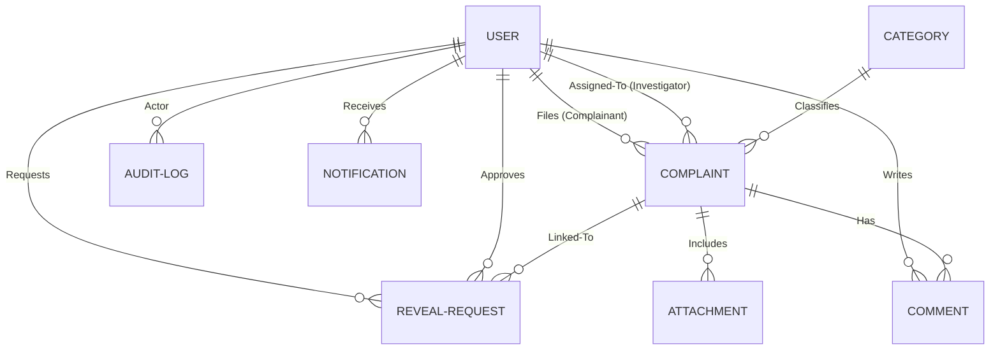

# RSCOE Student & Faculty Grievance Portal

A secure, production-grade grievance management platform designed for **JSPM's Rajarshi Shahu College of Engineering (RSCOE), Tathawade, Pune**.

---

## 1. Project Architecture & Monorepo Structure

The project is structured as a **Monorepo** using **npm workspaces** to decouple the frontend presentation, backend business logic, and shared structures.

```text
rscoe-grievance-portal/
├── apps/
│   ├── api/                   # Express + Node.js REST Backend API
│   │   ├── prisma/            # Database schema & migrations
│   │   ├── src/               # Application code (controllers, routes, middlewares)
│   │   └── Dockerfile
│   └── web/                   # Next.js 14 + Tailwind + TypeScript Client
│       ├── src/               # Pages, layouts, and web components
│       └── Dockerfile
├── packages/
│   └── shared/                # Code shared between apps/web and apps/api
│       └── src/               # Validation schemas (Zod) & TypeScript types
├── docker-compose.yml         # Local container orchestration (PG, Redis, MinIO)
├── .env.example               # Environmental variables template
├── package.json               # Root monorepo configuration
├── README.md                  # System architecture and documentation
└── tsconfig.json              # Base TypeScript configuration
```

### Decoupled Core Components
*   **Next.js Frontend (`apps/web`)**: Implements responsive dashboard interfaces for Student, Teacher, Head, and Super Admin roles. Utilizing Tailwind CSS and dynamic loading, the client integrates with the Node.js API.
*   **Express Backend (`apps/api`)**: A Node.js API managing business logic, attachments uploading, role-based checks, and strict privacy audits.
*   **Shared Contract (`packages/shared`)**: Houses validation models (Zod) and type definitions shared across the network boundary to guarantee API contracts.

---

## 2. Database Model

We use **Prisma ORM** with **PostgreSQL**. The relations and fields map the institution's organization and compliance guidelines:



### Database Tables:
*   **User**: Profiles for Students, Teachers, Department Heads, and Super Admins.
*   **Category**: Academic, infrastructure, harassment, or administrative classifications.
*   **Complaint**: The core entity storing description, status, urgency priority, and anonymity settings.
*   **Attachment**: Metadata pointing to files residing in S3.
*   **Comment**: Threaded communications linked to grievance resolution.
*   **RevealRequest**: Formal requests raised by Heads requesting the identity of an anonymous complainant.
*   **AuditLog**: Immutable event tracking including identity exposures.
*   **Notification**: Realtime updates directed to users.

---

## 3. Role-Based Access Control (RBAC)

The portal strictly enforces permissions by validating user roles (`STUDENT`, `TEACHER`, `HEAD`, `SUPER_ADMIN`) at the API Gateway:

| Request URI | Verb | Roles Allowed | Description |
| :--- | :---: | :---: | :--- |
| `/api/v1/auth/register` | `POST` | Public | Register new Student or Teacher account |
| `/api/v1/complaints` | `POST` | `STUDENT`, `TEACHER` | Submit a new grievance (anonymity optional) |
| `/api/v1/complaints` | `GET` | All (Authenticated) | Lists complaints (filters applied based on role/dept) |
| `/api/v1/complaints/:id/status` | `PATCH`| `HEAD`, `SUPER_ADMIN` | Update state status of complaint |
| `/api/v1/complaints/:id/assign` | `PATCH`| `HEAD`, `SUPER_ADMIN` | Assign complaint to investigator |
| `/api/v1/complaints/:id/reveal/request` | `POST` | `HEAD` | Initiate reveal request with reasoning |
| `/api/v1/reveal-requests/:requestId/approve`| `POST` | `SUPER_ADMIN` | Approve or reject a pending reveal request |
| `/api/v1/complaints/:id/reveal` | `GET` | `HEAD` | View revealed identity (creates audit entry) |
| `/api/v1/analytics/dashboard` | `GET` | `HEAD`, `SUPER_ADMIN` | View dashboard statistics |

---

## 4. Complaint Lifecycle

Complaints transition through the following states in a deterministic lifecycle:

1.  **SUBMITTED**: Grievance is filed. Complainant is notified.
2.  **UNDER_REVIEW**: Department Head opens the complaint and begins assessing details.
3.  **ASSIGNED**: Complaint is designated to a specific investigator/Head.
4.  **RESOLVED**: Resolution measures are proposed. Complainant has 7 days to review.
5.  **CLOSED**: Grievance closed automatically or confirmed by the complainant. If unresolved, the complainant can re-open, sending it back to `UNDER_REVIEW`.

---

## 5. Controlled Complainant Identity Visibility (Privacy)

Students/Teachers filing sensitive complaints can check an `isAnonymous` checkbox. When enabled:
*   The API automatically scrubs identity fields (`complainantId`, `complainant`) from generic endpoints.
*   If a Department Head (`HEAD`) requires identity exposure to resolve the issue, they must file a `RevealRequest` with a clear reason.
*   The request goes to a **Super Admin** for evaluation and approval.
*   Only after approval can the Head hit the `/reveal` endpoint.
*   The `/reveal` endpoint returns the identity **and** writes an immutable log to `AuditLog` containing:
    *   **Actor ID** (Head who accessed the data)
    *   **Complainant ID** (Whose identity was exposed)
    *   **Complaint ID**
    *   **Reason/Justification**
    *   **Timestamp** and **Client Network Info**

---

## 6. AWS Production Deployment Architecture

To host the portal on AWS in a highly available, secure, and compliant manner:

```text
                                [ Internet ]
                                     │
                                     ▼
                          [ AWS Route 53 (DNS) ]
                                     │
                                     ▼
                     [ Application Load Balancer ]
                                     │
                 ┌───────────────────┴───────────────────┐
                 ▼ (Port 3000)                           ▼ (Port 5000)
       [ ECS Fargate Service ]                 [ ECS Fargate Service ]
       ┌─────────────────────┐                 ┌─────────────────────┐
       │   Next.js Task 1    │                 │    Node.js Task 1   │
       │   Next.js Task 2    │                 │    Node.js Task 2   │
       └─────────────────────┘                 └─────────────────────┘
                 │                                       │
                 ▼                                       ├────────────────────────┐
        [ CloudFront CDN ]                               ▼                        ▼
     (Static Assets Cached)                       [ RDS Postgres ]        [ ElastiCache Redis ]
                                                  (Multi-AZ Active)       (Session / Rate limit)
                                                         │
                                                         ▼
                                                    [ AWS S3 ]
                                              (Encrypted Attachments)
```

### Core Architecture Components:
1.  **Application Hosting**: **AWS ECS (Elastic Container Service) with AWS Fargate** running serverless containers for both backend Node.js API and frontend Next.js server.
2.  **Database**: **AWS RDS PostgreSQL** deployed in a Multi-AZ configurations for automatic failover. Enabled Storage Encryption using AWS KMS keys.
3.  **Caching**: **AWS ElastiCache Redis** cluster for fast session verification and API rate limiting.
4.  **Storage**: **AWS S3** bucket configuration for documents and attachments, with versioning and KMS Server-Side Encryption (SSE-S3).
5.  **Traffic Routing**: **AWS ALB (Application Load Balancer)** running SSL termination (AWS Certificate Manager) routing traffic to ECS containers.
6.  **Static Distribution**: **AWS CloudFront** caching frontend static resources.

---

## 7. How to Run Locally

### Prerequisites:
*   Node.js (v20+)
*   Docker & Docker Compose

### Step 1: Environment Setup
Copy the configuration template:
```bash
cp .env.example .env
```

### Step 2: Start Infrastructure
Launch the local PostgreSQL database, Redis, and MinIO object storage:
```bash
docker-compose up -d
```

### Step 3: Install Workspace Dependencies
Execute the installation from the root directory:
```bash
npm install
```

### Step 4: Run Database Migrations
Initialize the DB tables:
```bash
npm run db:migrate --workspace=@rscoe-portal/api
```

### Step 5: Start Local Servers
Run the development servers concurrently:
*   API Backend (runs on port 5000):
    ```bash
    npm run dev:api
    ```
*   Web Frontend (runs on port 3000):
    ```bash
    npm run dev:web
    ```
