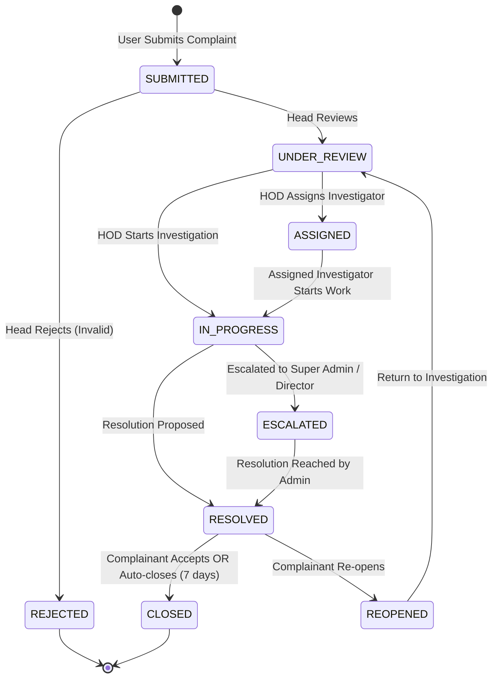

# Complaint Lifecycle & Workflow Specification

This document defines the states, triggers, actions, and transition pathways for complaints in the **RSCOE Student & Faculty Grievance Portal**.

---

## 1. Complaint Status Flowchart

---

## 2. State Descriptions

### Primary States:
1.  **SUBMITTED**: The default state. A student/teacher has filed the grievance. Alerts are sent to Department Heads.
2.  **UNDER_REVIEW**: A HOD/Head has opened the complaint and is analyzing the claims.
3.  **ASSIGNED**: HOD has designated a specific faculty investigator or officer to handle the case.
4.  **IN_PROGRESS**: The investigator/HOD is actively conducting inquiries (e.g., calling meetings, checking records).
5.  **RESOLVED**: HOD has proposed a formal resolution. The resolution notes are visible to the complainant.
6.  **CLOSED**: The grievance is officially solved. The complainant has approved the resolution, or the system auto-closed the grievance after 7 days of inactivity post-resolution.

### Exception States:
*   **REJECTED**: The grievance is found to be spam, duplicates, or out of scope. Rejecting requires HOD comments.
*   **ESCALATED**: Grievance could not be resolved within the department or exceeded SLA duration, automatically or manually escalating to the Super Admin / Director level.
*   **REOPENED**: The student/teacher feels the resolution was inadequate. They re-open the case, routing it back to `UNDER_REVIEW`.

---

## 3. State Transition Rules

The backend server strictly checks state transitions before committing updates:

| From State | Allowed To States | Trigger Event | Authorized Actor |
| :--- | :--- | :--- | :--- |
| `SUBMITTED` | `UNDER_REVIEW`, `REJECTED` | Read grievance, mark invalid | `HEAD`, `SUPER_ADMIN` |
| `UNDER_REVIEW` | `ASSIGNED`, `IN_PROGRESS` | Assign user, start work | `HEAD`, `SUPER_ADMIN` |
| `ASSIGNED` | `IN_PROGRESS` | Open case details, start log | `HEAD` (Assigned), `SUPER_ADMIN` |
| `IN_PROGRESS` | `RESOLVED`, `ESCALATED` | Propose fix, request hierarchy help | `HEAD` (Assigned), `SUPER_ADMIN` |
| `ESCALATED` | `RESOLVED` | Final executive fix | `SUPER_ADMIN` |
| `RESOLVED` | `CLOSED`, `REOPENED` | Accept resolution, dispute resolution | Complainant (`STUDENT`/`TEACHER`) |
| `REOPENED` | `UNDER_REVIEW`, `ESCALATED` | Re-investigate | `HEAD`, `SUPER_ADMIN` |
| `CLOSED` | None (Terminal) | - | - |
| `REJECTED` | None (Terminal) | - | - |
