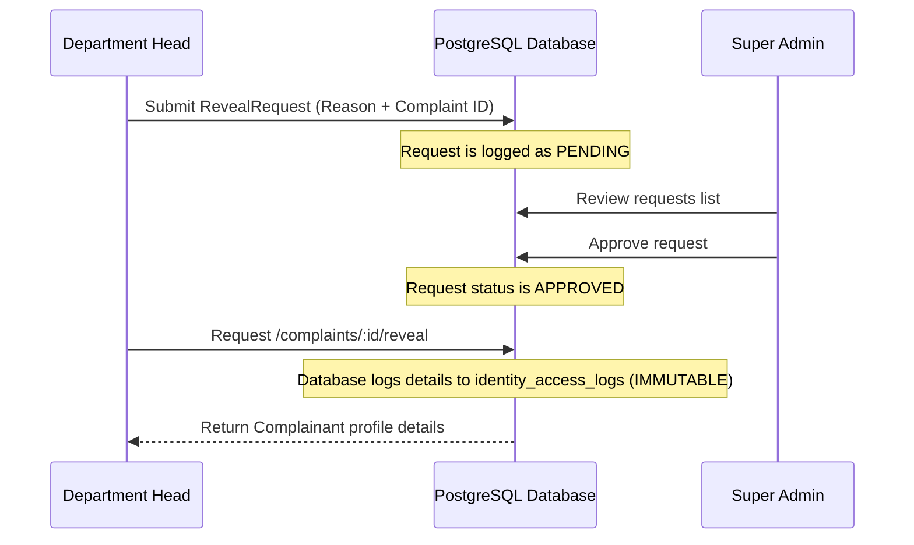

# Privacy & Identity Disclosure Specification

This document details the security and auditing protocols protecting student and faculty identity inside the **RSCOE Student & Faculty Grievance Portal**.

---

## 1. Privacy-First Identity Redaction

When a complainant files a grievance, they can toggle `is_anonymous` to `true`. This action triggers strict data sanitization rules at the database and API query levels:

1.  **Selective API Serialization**: When fetching complaints, the serialization model checks the user's role:
    *   If `is_anonymous` is true, the user model association details are set to `null` on the JSON response payload.
    *   The database returns placeholders: `{"fullName": "Anonymous Student", "email": "redacted@rscoe-portal.edu.in"}`.
2.  **Comment Threads**: When the complainant posts replies on their anonymous complaint, their author label is output as `Complainant (Anonymous)` rather than displaying their name.

---

## 2. Audited Identity Disclosure Workflow

In compliance with administrative investigation requirements, a Department Head (`HEAD`) may request the reveal of a complainant's identity under specific circumstances (e.g., severe harassment complaints, security threats, fake complaints).

The system enforces a **Dual-Authorization Break-Glass** or **Request-Approval** design:

### Steps:
1.  **File Request**: The HOD submits a POST to `/api/v1/complaints/:id/reveal/request` containing a clear justification text (minimum 10 characters). This creates a pending `RevealRequest`.
2.  **Super Admin Approval**: A Super Admin reviews the reason. If approved, the status transitions to `APPROVED`.
3.  **Reveal Access**: The HOD can now trigger the GET request `/api/v1/complaints/:id/reveal`.
4.  **Audit Generation**: Before yielding the response, the database transaction writes an immutable record to `identity_access_logs`.
5.  **Response Delivery**: Complainant profiles are serialized and returned to the authorized HOD.

---

## 3. Immutable Access Logging

The `identity_access_logs` table stores the record of the exposure:

| Field | Description | Source |
| :--- | :--- | :--- |
| `id` | Unique log entry UUID | Auto-generated |
| `actor_id` | User UUID of the HOD revealing the data | Session token |
| `complainant_id` | User UUID of the revealed complainant | Database relation |
| `complaint_id` | Complaint UUID | Request URL |
| `reason` | Approved justification text | `RevealRequest` table |
| `accessed_at` | Date and precise timestamp | Database default |
| `ip_address` | Host IP address of request | Express request metadata |
| `user_agent` | Browser user agent of request | Express request metadata |

---

## 4. Encryption-at-Rest Guidelines (Phase 2 Target)
*   **Database Encryption**: Deployed on AWS RDS, storage volumes are encrypted using AWS KMS managed keys.
*   **Data Fields Encryption (SLA-Compliant)**: Sensitive fields (like description, comments) can be symmetrically encrypted in NodeJS using `aes-256-gcm` prior to SQL inserts, ensuring data is unreadable in raw database dumps.
